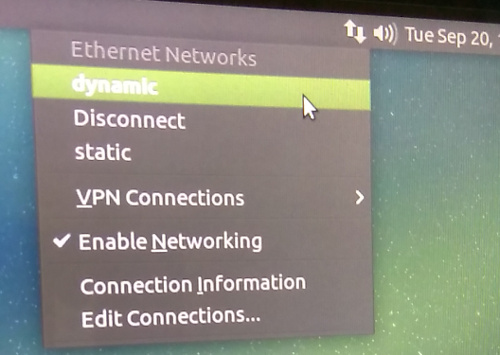
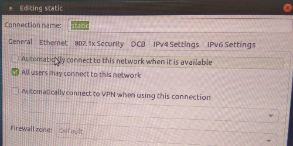

  -------------------------------------------------------------------------------------------------

User Manual
===========
  ------------- -----------------------------------------------------------------------------------

This user manual includes guidance for some of the day-to-day tasks that
may be required by an administrator (computer lab in-charge, teacher).
It is assumed that the administration has some basic knowledge of
working with a Linux distribution as the server is intended to be used
to teach the Linux subject in schools. Providing comprehensive server
administration guidance is outside the scope of this document.

We have created My sCool Server keeping in mind the “ease of use” so
quite a lot of tasks(not all of them) can be accomplished without having
to RTFM, however understanding that this device packs a lot of complex
technologies so to accomplish anything “under the hood” the
administrator must go through the instructions below at the minimum and
follow up reading the manuals provided by applications or online for
more details or tasks not covered here.

User Management
---------------

Via GUI:

System → Administration → Users and Groups

Via Commandline:

    sudo su \#Only mssadmin user is in sudoers group so log in as that user first

    useradd -m username \#this adds user

    passwd username \#creates password for user

    usermod -a -G epoptes username \#adds user to epoptes group, needed only for teachers/admin accounts

Default server is shipped with the following user accounts
pre-configured i.e. if no customisation has been requested during order
placement -

**student accounts:** student1 to student100; **password:** 12345

**teacher accounts:** teacher1 to teacher10; **password:** imteacher

Network
-------

MSS comes with 2 predefined network configurations: Static and Dynamic.

If there is no other DHCP server in the network select Static connection
from the NetworkManager in mssadmin account. If there is existing DHCP
server then selecting Dynamic setup will cause MSS to run in proxy-DHCP
mode, IPs will be assigned by external DHCP. Edit the setup which will
not be used to disable ‘auto connect’. No other configuration changes
are required.

Web Server
----------

The My sCool Server comes pre-configured with a ready to use web server
to help you host your content and make it available on the local
network.

Hosted content can be accessed from all clients via any web browser at
[*http://server/*](http://server/)

Each user can host their independent content at
/home/&lt;username&gt;/public\_html and it may be accessed by all at
[*http://server/\~&lt;username&gt;*](http://server/~username)

Epoptes
-------

Only user belonging to “epoptes” group can launch epoptes application,
see User Management for how to add user to a group. Using epoptes is
self evident and intuitive, however complete documentation is available
here:
[*https://translate.google.com/translate?u=http://ts.sch.gr/wiki/Linux/epoptes*](https://translate.google.com/translate?u=http://ts.sch.gr/wiki/Linux/epoptes)

When launching from Fatclient it has to be launched as below:

    ltsp-remoteapps epoptes

Creating Live USB
-----------------

Li-f-e: Linux for Education OS image is included on the server and can
be used to create a bootable media when logged in as mssadmin account
via -

System Tools -&gt; Live USB GUI

When creating a bootable media intended to boot computers that only
support EFI booting select “isohybrid” option. This option can also boot
on legacy hardware so use this if you are not sure about your hardware
capabilities. Use of “isohybrid” option is officially recommended way of
creating bootable USB. Do note that this will wipe the USB device and
cannot be used as a normal storage media from Windows PC. Use “Ubuntu”
option if you wish to use the device as a storage media on Windows or
preserve data on a vfat formatted USB stick.

The iso image is located at /recovery/Li-f-e.iso or /home/mssadmin/

It is convenient to use command line for running this task multiple
times as below:

    sudo live-grub-stick --isohybrid /recovery/Li-f-e.iso /dev/sdb

See the following links to learn how to boot from USB stick and
troubleshooting if the USB does not boot:

[*https://www.lifewire.com/change-the-boot-order-in-bios-2624528*](https://www.lifewire.com/change-the-boot-order-in-bios-2624528)

[*https://www.lifewire.com/how-to-boot-from-a-usb-device-2626091*](https://www.lifewire.com/how-to-boot-from-a-usb-device-2626091)

Backup and Recovery
-------------------

MSS provides ‘Factory Restore’ option via boot menu or special USB
created with the tool recovery.sh. Factory Restore will restore the
system to the state the server left our premises, which may include
customizations such as user accounts etc if the data is given at the
time of order placement.

-   Multiple snapshots can be created, it is limited by space allocated
    > to /recovery partition, however we are using borg deduplicated
    > backup so only the changes made to system are stored on rerun of
    > the following command as root (sudo su -):

    recovery.sh create

-   To restore to factory from running system, run the following as root
    > (sudo su -):

    recovery.sh restore [optional snapshot number]

-   Snapshots are numerical, 1 being the factory, by default running
    > restore will restore to that snapshot, to restore to last snapshot
    > taken run the following as root (sudo su -):

    recovery.sh restore last

-   To list all snapshots:

    sudo borg list /recovery/system

Snapshot management is beyond the scope of this tool and document, refer
borg documentation for details:
[*http://borgbackup.readthedocs.io/en/stable/usage.htm*](http://borgbackup.readthedocs.io/en/stable/usage.htm)

-   To create snapshot of /home for example:

    borg init --encryption=none /backup/folder/path /home

    borg create --stats --progress --compression lz4 /backup/folder/path/home::snapshotname /home

/backup/folder/path/ must have sufficient space.

-   To restore /home from snapshot

    borg mount /backup/folder/path/home::snapshotname /mnt

    rsync -avP /mnt/\* /home/

When done:

    umount /mnt

Troubleshooting
===============

**Booting**: If the client does not boot or freezes while working - It
can be caused by faulty network cable, connection or switch, try direct
connection to the server to ensure that the client and server both are
in working order then troubleshoot physical network.

**Panel**: If the panel does not show up -

Alt+F2 -&gt; resetpanel

**Default settings**: To bring the desktop to default settings of any
user run this in terminal from mssadmin account login -

    sudo mv /home/username/.config /home/username/.config-backup

Users can also try this from running session -

Alt+F2 -&gt; resetdesktop

Will need log out and back in for changes to apply.

Useful Documentation
====================

We have included Hackett and Bankwell comic books[^1] and content from
Spoken Tutorial[^2] that walks you through everything you need to know
about using Ubuntu linux, almost every GUI application comes with F1
help, and respective documentation in /usr/share/doc folder.

Lot more community created documentation is also available online:

[*https://ubuntu-manual.org/*](https://ubuntu-manual.org/)

[*https://help.ubuntu.com/*](https://help.ubuntu.com/)

[*https://ubuntu-mate.github.io/*](https://ubuntu-mate.github.io/)

[*https://help.ubuntu.com/community/CommonQuestions*](https://help.ubuntu.com/community/CommonQuestions)

[*https://help.ubuntu.com/community/Beginners/FAQ*](https://help.ubuntu.com/community/Beginners/FAQ)

[*http://askubuntu.com/questions?sort=faq*](http://askubuntu.com/questions?sort=faq)

[*https://ubuntu-mate.community/t/ubuntu-beginners-guide-complete-how-to-install-and-run-first-update/955/7*](https://ubuntu-mate.community/t/ubuntu-beginners-guide-complete-how-to-install-and-run-first-update/955/7)

[*https://ubuntu-mate.org/faq/*](https://ubuntu-mate.org/faq/)

Community help Ubuntu specific issues
=====================================

[*http://community.ubuntu.com/help-information/*](http://community.ubuntu.com/help-information/)

[*https://ubuntu-mate.org/community/*](https://ubuntu-mate.org/community/)

For issues specific to Li-f-e
=============================

[*https://sourceforge.net/projects/cyberorg-home/support*](https://sourceforge.net/projects/cyberorg-home/support)

For issues specific to MSS
==========================

[*https://github.com/cyberorg/myscoolserver/issues*](https://github.com/cyberorg/myscoolserver/issues)

Recommended reading before asking for assistance
================================================

[*http://www.catb.org/esr/faqs/smart-questions.html*](http://www.catb.org/esr/faqs/smart-questions.html)

Seeking Support 
----------------

Every My sCool Server has a sticker bearing a unique MSS ID. This ID is
important for all communications with Recherche Tech in regards to your
MSS hardware. If you ever have an issue with your MSS hardware and it is
under warranty, simply open a ticket through any of the support channels
and quote this MSS ID and the nature of your problem.

What next
---------
Frequently asked questions -
[*http://myscoolserver.com/faqs*](http://myscoolserver.com/faqs)

Discussion forum -
[*http://discourse.myscoolserver.com*](http://discourse.myscoolserver.com)

Feature videos -
[*https://www.youtube.com/c/myscoolserver*](https://www.youtube.com/c/myscoolserver)

Follow us on -

Twitter:
[*https://www.twitter.com/myscoolserver*](https://www.twitter.com/myscoolserver)

Facebook:
[*https://www.facebook.com/myscoolserver*](https://www.facebook.com/myscoolserver)

Google+:
[*https://plus.google.com/+Myscoolserver*](https://plus.google.com/+Myscoolserver)

Important Notice
----------------

Recherche Tech has supplied this Information believing it to be accurate and
reliable at the time of publishing, but is presented without warranty of
any kind, expressed or implied. Users must take full responsibility for
their application of any products. Recherche assumes no responsibility
for any errors that may appear in this document. Recherche reserves the
right, without notice to make changes in product design or
specifications. Information is subject to change without notice.

Important Links
---------------

Some helpful links

|Document Title|Offline version|Online version|
--------------|---------------|--------------|
| |(Shipped with server and available without internet)|(Latest version available on the internet)|
|Getting started Guide |http://server/mss/getting-started.html| http://www.myscoolserver.com/getting-started|
| User Guide | http://server/mss/user-guide.html | http://www.myscoolserver.com/user-guide |
| Recherche Legal Terms | http://server/mss/recherche-mss-legal-terms.html| http://www.myscoolserver.com/recherche-mss-legal-terms |
| MSS Terms of Service| http://server/mss/mss-service-terms.html | http://www.myscoolserver.com/mss-service-terms |
| Recherche Limited Product Warranty on MSS | http://server/mss/recherche-limited-product-warranty-mss.html | http://www.myscoolserver.com/recherche-limited-product-warranty-mss|

Restricted Rights
-----------------

Copyright 2016 Recherche Tech LLP. All rights reserved.

My sCool Server, My sCool Server logo are trademark of Recherche Tech
LLP.

-----------------------------------------------

**Corporate Headquarters**
                                                                                     
Recherche Tech LLP  
501/A, Synergy Building, L-74, Corporate Road, Makarba, Ahmedabad, Gujarat 380015. INDIA.                                                                                         
Phone: +91-79-40080440  
Web site: http://www.myscoolserver.com  
Visit [*www.myscoolserver.com/contact*](http://www.myscoolserver.com/contact) for the regional and latest contact information.

[^1]: [*http://hackettandbankwell.com/*](https://sourceforge.net/projects/cyberorg-home/support)

[^2]: [*http://spoken-tutorial.org/about-us/*](https://sourceforge.net/projects/cyberorg-home/support)
